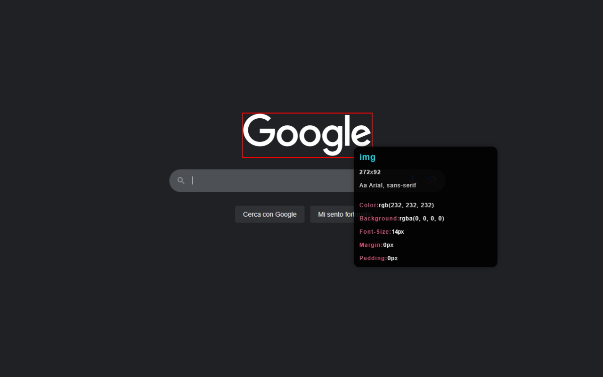

# CSS Scanner Chrome Extension

**CSS Scanner** is a Google Chrome extension designed to simplify the analysis of CSS at a glance.

## Features
- Scans the page to identify which CSS rules are actually used, highlighting potential redundancies or errors.

---

## License

This project is released under the [MIT](LICENSE) license. Feel free to use, modify, and redistribute it under the terms of the license.
